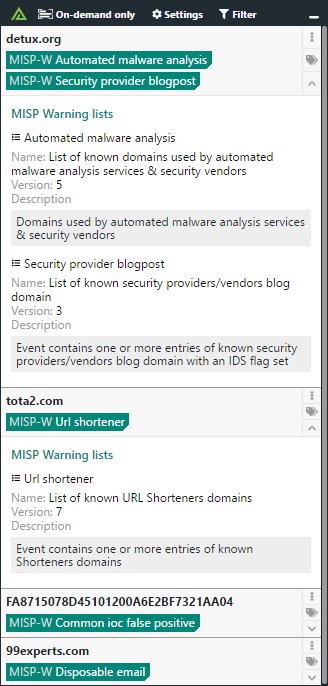

# Polarity MISP Warning Lists Integration

The Polarity MISP Warning Lists integration searches MISP hash, domain and IPv4 based warning lists and returns related list information.

|  |
|---|
|*MISP Warning lists lookup example* |

The MISP Warning Lists integration is designed to automatically fetch data from the MISP Warning lists github repository located here: https://github.com/MISP/misp-warninglists.  The integration can be set to automatically update lists, manually update lists via the MISP github repo, or manually update lists in an offline manner.

## Automatic list updates

By default the integration is configured to automatically fetch the latest list data every Sunday at 11:00 PM (server time).  For auto updating to work you must have `git` installed (`yum install git`) and have network connectivity available to the MISP warning lists Github repository located at https://github.com/MISP/misp-warninglists

> Note that `git` is installed by default if you are using the Polarity Server OVA

## Manual list updates via Github

To manually update the integration first ensure that automatic updates are disabled by unchecking the `Enable Auto Updates` option via the Polarity UI.  Then, from within the integration directory on your server run the following command:

```
npm run update:remote
```

For remote updates to work you must have `git` installed on your server (`yum install git`) and you must have network connectivity to the MISP warning lists github repository located at https://github.com/MISP/misp-warninglists

## Offline list updates via local repository

To update the integration's data in an offline manner you will need to download the MISP warning lists repository and place it inside this integration's directory.  You can download the repo from the following URL: https://github.com/MISP/misp-warninglists/archive/master.zip

Once downloaded, you will need to upload the repo to your Polarity Server's MISP warning lists integration directory:

```
/app/polarity-server/integrations/misp-warning-lists
``` 

After extracting the repo into the directory you should have the following path:

```
/app/polarity-server/integrations/misp-warning-lists/misp-warninglists
```

Ensure the repo is owned by the `polarityd` user:

```
chown -R polarityd:polarityd /app/polarity-server/integrations/misp-warning-lists
```

Finally, run the local update command from inside the integration directory

```
npm run update:local
```


## MISP Warning Lists Integration Options

### Enable Auto Update

If checked, the integration will automatically update the MISP warning list data from the MISP github repository every Sunday at 11:00 PM (polarity server time). This setting must be set to "Only admins can view and edit". The Polarity Server must have the `git` command line tool installed and have connectivity to `https://github.com/MISP/misp-warninglists`

### Enabled Lists

Select one or more MISP Warning Lists for which you would like to return results from. This setting must be set to "Only admins can view and edit". Restart the integration after changing this setting.

## Installation Instructions

Installation instructions for integrations are provided on the [PolarityIO GitHub Page](https://polarityio.github.io/).

## Polarity

Polarity is a memory-augmentation platform that improves and accelerates analyst decision making.  For more information about the Polarity platform please see:

https://polarity.io/
